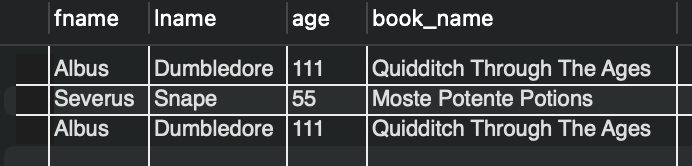

# Examples of work performed in MySQL Workbench.

[Database dumps used in the example](https://github.com/](https://drive.google.com/drive/u/3/folders/1MC0AttnmlAmugifFlX3hG6pssYZDqpPB)https://drive.google.com/drive/u/3/folders/1MC0AttnmlAmugifFlX3hG6pssYZDqpPB)

### 1. Выведите имя, фамилию персонажей и название книги, которая на них числится

```sql
SELECT c.fname, c.lname, l.book_name 
FROM characters AS c 
JOIN library AS l ON c.book_id = l.book_id;
```


### 2. Выведите имя, фамилию персонажей и название книги, вне зависимости от того, есть ли у них книги или нет

```sql
SELECT c.fname, c.lname, l.book_name 
FROM characters AS c 
LEFT JOIN library AS l ON c.book_id = l.book_id;
```


### 3. Выведите название книги и имя патронуса, вне зависимости от того, есть ли информация о держателе книги в таблице или нет

```sql
SELECT l.book_name, c.patronus 
FROM library AS l 
LEFT JOIN characters AS c ON c.book_id = l.book_id;
```


### 4. Выведите имя, фамилию, возраст персонажей и название книги, которая на них числится, при условии, что все владельцы книг должны быть старше 15 лет

```sql
SELECT c.fname, c.lname, c.age, l.book_name 
FROM characters AS c 
JOIN library AS l ON c.book_id = l.book_id 
WHERE c.age > 15;
```


### 5. Выведите имя персонажа, название книги, дату выдачи и дату завершения, при условии, что он младше 15 лет и его патронус неизвестен

```sql
SELECT c.fname, c.lname, l.book_name, l.start_date, l.end_date 
FROM characters AS c 
JOIN library AS l ON c.book_id = l.book_id 
WHERE c.age < 15 AND c.patronus = 'Unknown';
```


### 6. Используя вложенный запрос количество книг, у которых end_date больше, чем end_date у Hermione

```sql
SELECT COUNT(*) 
FROM library 
WHERE end_date > (SELECT end_date FROM library WHERE char_id = (SELECT char_id FROM characters WHERE fname = 'Hermione'));
```


### 7. С помощью вложенного запроса выведите имена всех патронусов, у которых владельцы старше возраста персонажа, у которого патронус Unknown

```sql
SELECT patronus 
FROM characters 
WHERE age > (SELECT age FROM characters WHERE patronus = 'Unknown');
```

